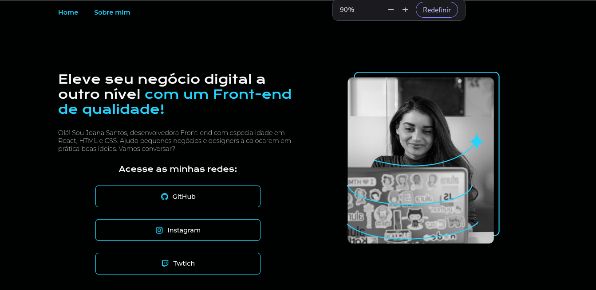

Este projeto consiste em uma página web desenvolvida durante as semanas 5 a 8 da formação Include Alura. O objetivo foi colocar em prática conceitos fundamentais de desenvolvimento web, desde a estruturação do HTML até a estilização com CSS, incluindo responsividade, navegação entre páginas e publicação da aplicação.

## Objetivos

Durante este projeto foram praticados os seguintes conceitos:

- Estruturação de páginas utilizando HTML5;
- Estilização com CSS3;
- Organização do código em arquivos separados;
- Layout responsivo utilizando Media Queries;
- Navegação entre múltiplas páginas;
- Boas práticas de organização de arquivos;
- Publicação (Deploy) da aplicação.

## Tecnologias

- HTML5
- CSS3
- Git
- Vercel

## Acesse o projeto

[Lading page responsiva](https://landing-page-responsiva-sigma.vercel.app/)
